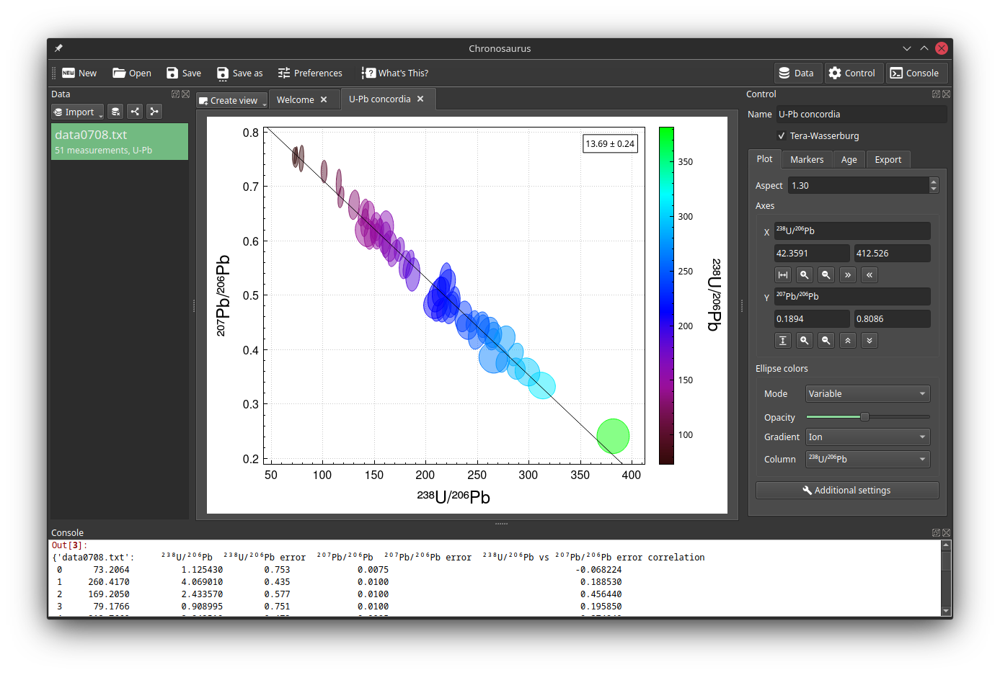

# Chronosaurus

## About


**Chronosaurus** is an open source, plugin-based plotting application focused on geochronology. It can read data from a variety of sources including: delimited text, Excel (file or interactively), iolite, clipboard, and other specialized formats. It can construct a variety of plots and optionally calculate things like U-Pb concordia ages. Best of all, you can improve the built-in import and visualization plugins (by creating pull requests) or create new plugins. It looks roughly as shown below.



## Installation

1. Download the [latest release](https://github.com/japetrus/chronosaurus/releases/latest) for your operating system.
2. Extract the zip.
3. Run the chronosaurus executable.

## Development

1. Clone this repository.
2. Install dependencies (optionally in a virtual environment). For example:
```
python3 -m venv .venv
source .venv/bin/activate
pip install wheel
pip install -r requirements.txt
pip install -r requirements-dev.txt
```
3. Build resources (.ui and .qrc files).
```
python setup.py build_res
```
4. Run the app.
```
python -m app
```
4. Build the app for distribution.
```
python setup.py bdist_app
```
5. Build the docs (note: the actual content has not yet been written!)
```
python setup.py build_docs
```


## Disclaimer

Chronosaurus is provided "as is". Use the software at your own risk.